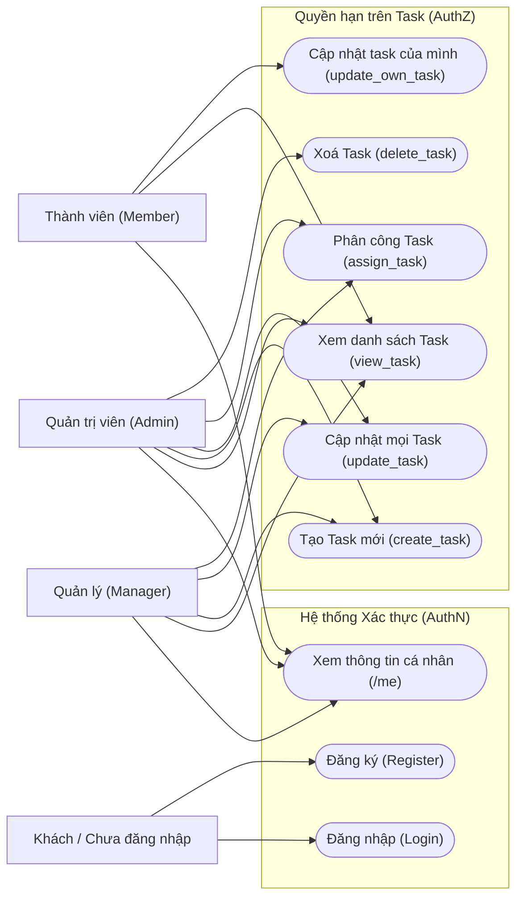
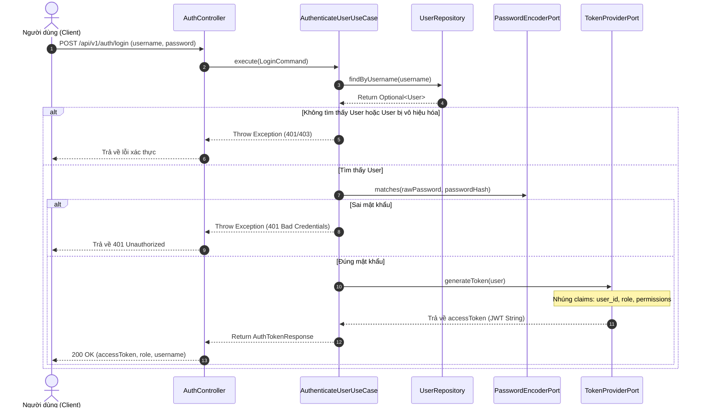
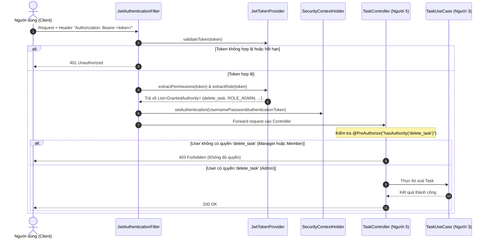

# TÀI LIỆU THIẾT KẾ UML - NGƯỜI 6 (USER & AUTH SUBDOMAIN)

> **Dự án:** Task Management System  
> **Kiến trúc:** Domain-Driven Design (DDD) & Clean Architecture  
> **Phạm vi tài liệu:** Module Người 6 phụ trách (User, Role, Permission, Authentication, Authorization, Assignment)

---

## 1. Biểu đồ Ca sử dụng (Use Case Diagram)

Biểu đồ này thể hiện phân cấp quyền hạn giữa các tác nhân (**Guest**, **Member**, **Manager**, **Admin**) theo đúng ma trận phân quyền đề bài giao:

---

## 2. Biểu đồ Lớp (Class Diagram) - Chuẩn Clean Architecture & DDD

Tách bạch 4 tầng kiến trúc: **Domain**, **Application**, **Infrastructure**, **Presentation**.

```mermaid
classDiagram
    %% TẦNG DOMAIN (LÕI NGHIỆP VỤ)
    namespace Domain_Layer {
        class Permission {
            <<enumeration>>
            CREATE_TASK
            UPDATE_TASK
            DELETE_TASK
            ASSIGN_TASK
            VIEW_TASK
            UPDATE_OWN_TASK
            +getValue() String
        }

        class Role {
            <<enumeration>>
            ADMIN
            MANAGER
            MEMBER
            -Set~Permission~ permissions
            +getPermissions() Set~Permission~
        }

        class User {
            -UUID id
            -String username
            -String email
            -String passwordHash
            -Role role
            -boolean active
            +hasPermission(Permission) boolean
            +canBeAssignedTask() boolean
            +activate() void
            +deactivate() void
            +changeRole(Role) void
        }

        class UserRepository {
            <<interface>>
            +findById(UUID) Optional~User~
            +findByUsername(String) Optional~User~
            +findByEmail(String) Optional~User~
            +save(User) User
            +existsByUsername(String) boolean
            +existsByEmail(String) boolean
        }
    }

    %% TẦNG APPLICATION (USE CASES & PORTS)
    namespace Application_Layer {
        class PasswordEncoderPort {
            <<interface>>
            +encode(String) String
            +matches(String, String) boolean
        }

        class TokenProviderPort {
            <<interface>>
            +generateToken(User) String
            +extractUserId(String) UUID
            +validateToken(String) boolean
        }

        class AuthenticateUserUseCase {
            -UserRepository userRepository
            -PasswordEncoderPort passwordEncoder
            -TokenProviderPort tokenProvider
            +execute(LoginCommand) AuthTokenResponse
        }

        class RegisterUserUseCase {
            -UserRepository userRepository
            -PasswordEncoderPort passwordEncoder
            +execute(RegisterUserCommand) UserResponse
        }
    }

    %% TẦNG INFRASTRUCTURE (SECURITY & DATABASE)
    namespace Infrastructure_Layer {
        class BcryptPasswordEncoderAdapter {
            -PasswordEncoder passwordEncoder
            +encode(String) String
            +matches(String, String) boolean
        }

        class JwtTokenProvider {
            -Key key
            -long expiration
            +generateToken(User) String
            +extractUsername(String) String
            +extractRole(String) String
            +extractPermissions(String) List~String~
        }

        class UserRepositoryImpl {
            -SpringDataJpaUserRepository jpaRepository
            +findById(UUID) Optional~User~
            +save(User) User
        }

        class UserJpaEntity {
            -UUID id
            -String username
            -String email
            -String passwordHash
            -Role role
            -boolean active
        }
    }

    %% TẦNG PRESENTATION (CONTROLLER)
    namespace Presentation_Layer {
        class AuthController {
            -RegisterUserUseCase registerUserUseCase
            -AuthenticateUserUseCase authenticateUserUseCase
            +register(RegisterUserCommand) ResponseEntity
            +login(LoginCommand) ResponseEntity
            +getCurrentUserInfo(Authentication) ResponseEntity
        }
    }

    %% MỐI QUAN HỆ GIỮA CÁC LỚP
    Role "1" *-- "many" Permission : contains
    User "1" *-- "1" Role : has

    AuthenticateUserUseCase ..> UserRepository : uses
    AuthenticateUserUseCase ..> PasswordEncoderPort : uses
    AuthenticateUserUseCase ..> TokenProviderPort : uses

    RegisterUserUseCase ..> UserRepository : uses
    RegisterUserUseCase ..> PasswordEncoderPort : uses

    BcryptPasswordEncoderAdapter ..|> PasswordEncoderPort : implements
    JwtTokenProvider ..|> TokenProviderPort : implements
    UserRepositoryImpl ..|> UserRepository : implements
    UserRepositoryImpl ..> UserJpaEntity : maps to/from

    AuthController ..> AuthenticateUserUseCase : calls
    AuthController ..> RegisterUserUseCase : calls
```

---

## 3. Biểu đồ Tuần tự (Sequence Diagram)

### Luồng 1: Đăng nhập và Nhận Token JWT (Authentication Flow)
Mô tả quy trình người dùng gửi thông tin đăng nhập, hệ thống kiểm tra mật khẩu đã mã hóa và sinh JWT Token chứa danh sách quyền hạn.

---

### Luồng 2: Xác thực & Phân quyền khi gọi API được bảo vệ (Authorization Flow)
Minh họa khi Người dùng gọi API bảo vệ (ví dụ: `DELETE /api/v1/tasks/{id}`) có gắn `@PreAuthorize("hasAuthority('delete_task')")`.

